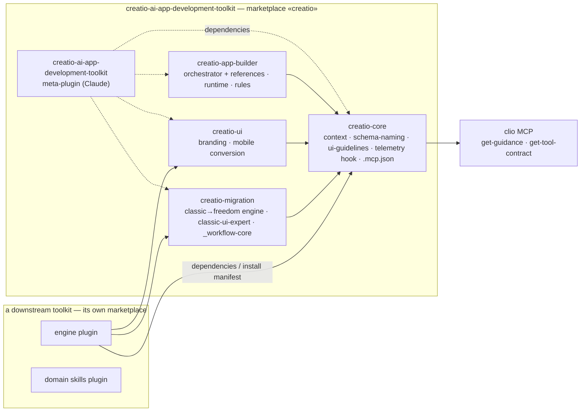

# ADR — Architectural Solution: *"Multi-plugin marketplace for the Creatio AI App Development Toolkit"*

**Status:** Approved

---

## 1. Goal

**Purpose:**
The Creatio AI App Development Toolkit (CAADT) ships as one indivisible plugin: four host manifests at the
repository root all point at a single `skills/`, and the orchestration policy, runbooks, context, hooks and
Python runtime are one payload. A consumer who wants only a part of it — the Freedom UI canon, the naming
rules, the migration engine — has to take everything. Downstream toolkits therefore copied skills and context
files and drifted from them. The goal is a toolkit that is **modular**: a marketplace of independently
installable plugins with a shared core, so other toolkits depend on CAADT packages instead of copying files,
and so a user installs only the profile they need on Claude Code, Codex CLI, GitHub Copilot CLI and Cursor.

---

## 2. Requirements

### 2.1 Functional Requirements

| Requirement | Achieved by | Comment |
| ----------- | ----------- | ------- |
| Several plugins are served from one repository and one marketplace | `plugins/<name>/` per plugin; the three catalogs (`.claude-plugin/marketplace.json`, `.agents/plugins/marketplace.json`, `.github/plugin/marketplace.json`) list each plugin with the host's own `source` shape | Verified live on Claude Code 2.1.263, Codex CLI 0.130/0.153, Copilot CLI 1.0.46 |
| A plugin is installable on its own | one flat `skills/` and four host manifests per plugin; every plugin depends only on `creatio-core` | Cross-plugin file references are replaced by skill names / clio `get-guidance` in a follow-up change |
| The existing install name keeps working | root `.claude-plugin/plugin.json` becomes a dependencies-only meta-plugin `creatio-ai-app-development-toolkit` | Claude only; on Codex/Copilot the installer performs one install per plugin |
| A downstream toolkit depends on CAADT plugins instead of copying them | the consumer declares `dependencies` on the CAADT plugins it needs (Claude) and its installer installs the same list from the `creatio` marketplace (all hosts) | Copies are deleted in the same release the dependency is introduced |
| Named profiles for end users | `install.py --profile minimal \| app-builder \| full` | Follow-up change to the installer |
| Skills stay discoverable by description on every host | skill names unchanged; hosts namespace them as `<plugin>:<skill>` | Verified in live sessions on all three hosts |

### 2.2 Non-functional Requirements

| Requirement | Achieved by | Comment |
| ----------- | ----------- | ------- |
| Git history of every moved file survives | `git mv` only; no copy-then-delete | `git log --follow` on a moved SKILL.md shows the pre-move history |
| No duplicate skills reach the model | one home per skill; a downstream marketplace never re-exports CAADT plugins; a consumer installer refuses a plugin already installed from another marketplace | Both Claude and Copilot expose duplicates when the same name arrives twice (see §8) |
| Users of the `release` channel never receive unreleased content | catalog entries pin the payload to the `release` branch (`url`/`github`/`git-subdir` + `ref`); the Copilot catalog on `main` is always valid | Copilot reads the catalog from the default branch only and accepts no ref (see §8) |
| One line-ending convention | `.gitattributes` pins text files to LF | Makes diffs between CAADT and downstream copies show content, not CRLF noise |
| Manifests cannot drift | one `plugin.yaml` per plugin generates the four host manifests and the three catalogs; `--check` in CI | Follow-up change to the release tooling |
| The change is releasable as a major version | 2.0.0 with an updater that migrates a 1.x single-plugin install | Install composition changes, so semver MAJOR |

---

## 3. Risk Factors

| Category               | Degree | Description | Mitigation |
| ---------------------- | ------ | ----------- | ---------- |
| Assumptions & Concerns | HIGH   | Codex CLI has no non-interactive plugin install: `codex plugin add`/`install` do not exist. Enabling a plugin in `config.toml` does not load its skills; only the `/plugins` browser's install cache does. | The installer performs the two steps the browser does (copy into `plugins/cache/<marketplace>/<plugin>/<version>/`, write `[plugins."<plugin>@<marketplace>"] enabled = true`) — PR #168. |
| Assumptions & Concerns | HIGH   | Double installation: the same plugin from two marketplaces, or the same skill name from two plugins, coexists and both skill bodies are shown to the model on Claude and Copilot. | A downstream marketplace does not re-export CAADT plugins; it deletes its copies in the release that starts depending on `creatio-core`; its installer refuses a name already installed from another marketplace. |
| Assumptions & Concerns | Medium | Copilot CLI reads a marketplace only from the repository's default branch and accepts no ref; a relative `./plugins/<n>` entry on `main` installs unreleased content. | Today only the Claude meta-plugin entry is pinned (`url` + `ref: release`); the per-plugin Codex and Copilot entries are relative sources. The release-tooling follow-up switches them to `github` + `ref: release` + `path` objects; until it ships, `main` is not announced as released and keeps a valid catalog at all times. |
| Assumptions & Concerns | Medium | A plugin rooted at the repository root auto-discovers a root `skills/` directory, recreating the duplication the split removes. | The meta-plugin lives at the root only once root `skills/` is gone (PR #169); during the spike it lived in `plugins/creatio-ai-app-development-toolkit/`. |
| Assumptions & Concerns | Medium | Plugin dependencies exist only in Claude Code; Codex and Copilot have no dependency or meta-plugin mechanism. | "A consumer requires CAADT plugins" is enforced by the consumer's installer on every host; `dependencies` is a Claude-only convenience. |
| Assumptions & Concerns | Medium | The telemetry hook moves into `creatio-core` and therefore runs for every consumer of the core, including ones that previously removed it. | Decision pending (§9); if unacceptable, split `creatio-core` and `creatio-telemetry`. The hook is non-blocking and consent-gated. |
| Assumptions & Concerns | Low    | Environment-derived install paths are flagged by SonarCloud as untrusted input (`pythonsecurity:S2083`). | `$CODEX_HOME` override dropped; the installer writes only into `~/.codex`, the directory it detects. |
| Assumptions & Concerns | Low    | Sibling PRs (#168 installer fix, #169 layout) both touch `installer/install.py`. | Trial merge shows no conflicts; merge order documented. |
| Assumptions & Concerns | Low    | Codex caches every installed version and Claude leaves orphaned cache directories after uninstall. | The updater never relies on an empty cache; it replaces the plugin's version directory. |

---

## 4. Architectural Solution

### 4.1 Description

**One repository, one marketplace, several plugins.** `creatio-ai-app-development-toolkit` becomes the
`creatio` marketplace. Each plugin lives in `plugins/<name>/` with one flat `skills/` directory, its own four
host manifests (`.claude-plugin/`, `.codex-plugin/`, `.cursor-plugin/`, `.github/plugin/`) and, where needed,
its own `context/`, `hooks/`, `runtime/`, `rules/` and `.mcp.json`.

| Plugin | Responsibility | Depends on |
|---|---|---|
| `creatio-core` | shared knowledge: `context/`, `creatio-schema-naming`, `creatio-ui-guidelines`, the product-telemetry hook, the clio MCP declaration | — (knows about no other plugin) |
| `creatio-app-builder` | the Business Plan → Gate R → implementation workflow: `creatio-app-orchestrator` with the orchestration policy, runbooks and business checklist as `references/`, Python `runtime/`, the Cursor rule | `creatio-core` |
| `creatio-ui` | `creatio-branding-orchestrator`, `creatio-mobile-page-conversion` | `creatio-core` |
| `creatio-migration` | `classic-to-freedom-migration` with its engine, `classic-ui-expert`, `_workflow-core` | `creatio-core` |
| `creatio-ai-app-development-toolkit` (root) | meta-plugin: `dependencies` on the four above, no components | Claude only |

**Dependency direction is one way**: module → `creatio-core` → clio MCP. References across plugins take
exactly three forms — a skill name ("invoke the `creatio-ui-guidelines` skill"), a file inside the same skill
(`./references/…`), or a clio `get-guidance` article. A relative path crossing a plugin root is forbidden and
checked by a boundary test, because install directories differ per host and per plugin.

**Cross-cutting concerns leave the skill bodies.** Product telemetry is emitted by the hook shipped in
`creatio-core`; a skill declares only how it participates. This removes the largest source of drift between
CAADT and its downstream copies.

**Installation is host-specific but profile-driven.** Claude Code, Codex CLI and Copilot CLI register the
marketplace and install the plugins of a profile; Cursor copies the plugins of the profile. Codex has no
install verb, so the installer materializes the plugin cache and enables the plugin in `config.toml` itself.

**Downstream toolkits depend, they do not copy.** A consumer toolkit keeps its own marketplace with its own
plugins and declares its needs on CAADT plugins; its installer registers the `creatio` marketplace first and
installs the required set. Nothing from CAADT is re-exported in a consumer's catalog.

### 4.2 Related Functionalities

- CAADT installer (`installer/install.py`, `installer/update.py`) — profiles, Codex cache materialization,
  1.x → 2.0 migration, Cursor copy of `plugins/*/skills`.
- Release pipeline (`.github/workflows/release.yml`, `scripts/bump-version.js`, `.release-manifest.json`,
  `.version-bump.json`) — per-plugin zips, `<plugin>--v<version>` tags for Claude's dependency resolver, one
  family version in the first phase.
- Manifest generator (`plugin.yaml` → host manifests and catalogs).
- Repository tests: `tests/test_release_structure.py` (plugin layout, catalogs, anchored references), the
  plugin boundary test, installer and updater tests, engine golden tests, telemetry hook tests.
- Documentation: `AGENTS.md`, `README.md`, `docs/install.md`, `docs/release-structure.md`,
  `docs/versioning-and-release.md`, the Academy setup wizard (unchanged: it calls `install.py`).

### 4.3 Diagrams



```mermaid
sequenceDiagram
    participant U as User / installer
    participant C as Claude Code
    participant X as Codex CLI
    participant G as Copilot CLI
    U->>C: plugin marketplace add <repo>; plugin install creatio-app-builder@creatio
    C->>C: resolve dependencies → creatio-core (tags <plugin>--v<ver>)
    U->>X: plugin marketplace add <repo>
    U->>X: copy plugins/<n> → $CODEX_HOME/plugins/cache/creatio/<n>/<ver>/; config.toml [plugins."<n>@creatio"] enabled=true
    U->>G: plugin marketplace add <repo> (default branch catalog); plugin install <n>@creatio (payload pinned to release once the release tooling lands)
```

---

## 5. Threat Analysis

The change affects the **software supply chain of the toolkit**, not Creatio application security. No formal
STRIDE analysis was performed; the relevant observations are recorded here:

- Copilot CLI reads the catalog from the default branch, so an unpinned catalog entry would install unreleased
  `main` content into a user's agent. Mitigation: `ref: release` pinning of every per-plugin catalog entry, which the
  release-tooling follow-up adds; at the time of this decision only the Claude meta-plugin entry is pinned, and `main`
  is not released until that follow-up ships.
- Two installs of the same skill name reach the model; a malicious or stale duplicate could shadow the
  canonical one. Mitigated by the no-re-export rule and by installers refusing duplicates.
- Installer paths derived from environment variables were flagged as untrusted input (S2083); the installer
  now writes only under the detected `~/.codex`.

`See: [Threat Analysis – Multi-plugin marketplace](#)` — not required for this decision; revisit if the
catalog ever accepts third-party plugins.

---

## 6. Technology Principles

| Principle                      | How It’s Achieved | Comments |
| ------------------------------ | ----------------- | -------- |
| AI-Native Platform Development | Skills stay the unit of AI capability; each plugin is a coherent set of skills selected by description at the point of work; knowledge shared by many skills lives in `creatio-core`, executable truth stays in clio MCP. | — |
| Scalable Modular Architecture  | Plugins with one-way dependencies on a core, boundary tests, one flat `skills/` per plugin, profiles for installation. A new capability is a new plugin directory and a catalog entry. | A downstream toolkit follows the same rule for its own plugins. |
| Use of Proven Solutions        | Uses the hosts' own plugin/marketplace mechanisms (Claude `dependencies` and meta-plugins, Codex `local`/`git-subdir` sources, Copilot `github` sources) instead of a bespoke registry; formats were verified against official documentation and live CLIs. | The v1 item "multi-plugin packaging" deferred in `docs/release-structure.md` is now delivered. |
| Keep the Technology Up-To-Date | The spike exposed that the Codex CLI dropped `plugin add`; the installer follows the current CLI surface and pins the minimum tested versions. | Re-verify on host CLI upgrades (nightly install smoke). |
| Developer-Centric Ecosystem    | Consumers depend on packages instead of copying files; `--plugin-dir` and `codex debug prompt-input` are documented as the fast local test loops. | — |
| Automation-First               | Manifests and catalogs generated from `plugin.yaml` with a `--check` gate; `bump-version --check/--audit`; boundary test; per-plugin release zips and tags. | — |

---

## 7. Quality Indicators (Each category if applicable to ADR context)

#### 7.1 Conceptual Integrity

**Stack:** Backend (repository/tooling)
Three rules govern the design: one-way dependencies on `creatio-core`; three sanctioned reference forms
(skill name, own `./references/`, clio `get-guidance`); cross-cutting concerns live in hooks and context, not
in skill bodies. The layout is the same on every host; only the `source` shape in the catalog differs.

#### 7.2 Maintainability

**Stack:** Backend
Repository tests pin the layout (plugin manifests, catalogs, anchored references, boundary test), the
generated artifacts (`build-workflows --check`, `build-manifests --check`), and the installer behaviour (pytest
with fake host CLIs). Drift between CAADT and downstream is made impossible by removing the copies, not by
detecting it.

#### 7.3 Reusability

**Stack:** Backend
`creatio-core` is the reusable unit; any downstream toolkit installs it from the `creatio` marketplace.
Shared changes go through CAADT pull requests.

#### 7.5 Interoperability

**Stack:** Backend
Four host CLIs with different manifest fields (`skills` string vs array, `dependencies` present or absent,
`source` object shapes) and different install mechanics (Codex cache materialization, Copilot default-branch
catalog). Coordination with the Academy setup wizard.

#### 7.10 Security

**Stack:** Backend
See §5. No authentication or role model is affected; the change is confined to install paths and catalogs.

#### 7.12 Testability

**Stack:** Backend
Unit: pytest (installer, layout, contracts). Integration: real host CLIs against isolated homes
(`CLAUDE_CONFIG_DIR`, `CODEX_HOME`, overridden `HOME`) and `--plugin-dir` live sessions; `codex debug
prompt-input` renders the model-visible skill list without a model call.

#### 7.16 Backward Compatibility

**Stack:** Backend
The install name `creatio-ai-app-development-toolkit@creatio` survives as the Claude meta-plugin; Codex and
Copilot 1.x installs are migrated by `update.py` to the profile set. Skill names are unchanged, so prompts and
docs that name a skill keep working; only the namespace prefix changes.

#### 7.18 Extensibility

**Stack:** Backend
Adding a plugin: a directory under `plugins/`, a `plugin.yaml`, a catalog entry, a `CODEOWNERS` line. Adding a
downstream toolkit: a marketplace that declares dependencies and an install manifest — no file copies.

---

## 8. Prototype and Research

Spike on branch `spike/multi-plugin` (PR #167, 2026-09-07, Windows 11). Two plugins were **copied** into
`plugins/` beside the untouched 1.10.0 tree so the hosts could be exercised before any file moved; the branch
is not merged by design and this section preserves its results.

**Hosts:** Claude Code 2.1.263 · Codex CLI 0.130.0 / 0.153.4 · GitHub Copilot CLI 1.0.46. Every install ran in
an isolated configuration (`CLAUDE_CONFIG_DIR`, `CODEX_HOME`, `HOME`+`USERPROFILE`).

**Claude Code**

| Check | Result |
|---|---|
| Marketplace from a local clone; install `creatio-core@creatio`, `creatio-ui@creatio` | installed, cached under `plugins/cache/creatio/<plugin>/<version>/` |
| Install only `creatio-ui` on a fresh config | `+ 1 dependency: creatio-core` |
| Install the meta-plugin on a fresh config | `+ 2 dependencies: creatio-core, creatio-ui` |
| Telemetry hooks in the moved manifest; hook run from the cache path | preserved; exit 0 for `UserPromptSubmit` and `PostToolUse` |
| Live session (`--plugin-dir`) | `creatio-core:creatio-schema-naming`, `creatio-core:creatio-ui-guidelines`, `creatio-ui:creatio-branding-orchestrator`; the installed 1.10.0 copies listed alongside — duplicates are shown, not de-duplicated |
| Same plugin from a second marketplace `creatio-test` | installed alongside, both enabled, both skill trees loaded |
| Uninstall | dependency-aware (`prune` hint); cache directories remain with `.orphaned_at` |
| Remote install from the pushed branch | `marketplace add owner/repo#branch` → meta-plugin with 2 dependencies; source recorded as `github` + `ref` |

**Codex CLI**

| Check | Result |
|---|---|
| `codex plugin marketplace add <local clone>` / `<url> --ref <branch>` | registered (`local` / `git` source); `marketplace upgrade` works for git sources only |
| `codex plugin add` / `codex plugin install` | **subcommands do not exist** (0.130 and 0.153) |
| `[plugins."creatio-core@creatio"] enabled = true` alone | skills **not** in the model-visible prompt (`codex debug prompt-input`) |
| Plugin copied to `$CODEX_HOME/plugins/cache/creatio/creatio-core/2.0.0/` + enabled | skills present; live session (`gpt-5.4-mini`) lists `creatio-core:creatio-schema-naming`, `creatio-core:creatio-ui-guidelines`, `creatio-ui:creatio-branding-orchestrator` |
| Manifest shape vs OpenAI's bundled plugins | same required fields; OpenAI adds an optional `interface` block for the plugin browser |

**GitHub Copilot CLI**

| Check | Result |
|---|---|
| Marketplace from a local clone; `browse`; install both plugins | listed; `Installed 2 skills` / `Installed 1 skill`; whole plugin directory copied to `~/.copilot/installed-plugins/creatio/<plugin>/` |
| Same plugin from `creatio-test` | installed alongside; both skill trees on disk |
| Live session (`--plugin-dir`) | three spike skills plus the same three names from the installed 1.7.0 plugin — `TOTAL=6`, duplicates shown |
| Marketplace add with a ref (`owner/repo#ref`, `URL#ref`) or direct `owner/repo:path` install from a branch | **no way to pass a ref**; the catalog and paths are read from the default branch |

**Existing test suite on the spike branch:** 636 passed, 3 failed by design (`test_marketplace_catalogs_point_to_plugin`,
`test_repo_versions_are_in_sync`, the public-wording check) — inputs for the release-tooling follow-up.

**Verdict:** GO, with four adjustments now encoded in §3: meta-plugin placement, no re-export and same-release
copy deletion downstream, Codex install via cache materialization, Copilot catalog pinning.

---

## 9. Decision Log

| Date | Decision | Owner | Status |
| ---- | -------- | ----- | ------ |
| 2026-09-07 | Split CAADT into a marketplace of plugins with a shared core; downstream toolkits depend on CAADT plugins instead of copying them | | Approved |
| 2026-09-07 | Two marketplaces, one installer: a downstream toolkit does not re-export CAADT plugins; installation of the CAADT set is enforced by its installer on every host, `dependencies` only on Claude | | Approved |
| 2026-09-07 | Spike concluded GO with four adjustments (meta-plugin placement, duplicate handling, Codex cache materialization, Copilot catalog pinning) | | Recorded |
| 2026-09-08 | ADR recorded; Codex installer fix (PR #168) and plugin layout (PR #169) in review | | Approved |
| open | Telemetry hook stays in `creatio-core` for every consumer, or `creatio-core` is split from `creatio-telemetry` | | Pending |
| open | One skill-description canon for the plugin family | | Pending |

---

## 10. References

- Pull requests: [#167](https://github.com/Creatio-Platform/creatio-ai-app-development-toolkit/pull/167) spike (not merged), [#168](https://github.com/Creatio-Platform/creatio-ai-app-development-toolkit/pull/168) Codex install fix, [#169](https://github.com/Creatio-Platform/creatio-ai-app-development-toolkit/pull/169) plugin layout.
- Claude Code docs: plugins, plugin marketplaces, plugin dependencies (`dependencies`, meta-plugins, `<plugin>--v<version>` tags, `allowCrossMarketplaceDependenciesOn`).
- Codex CLI docs: `developers.openai.com/codex/plugins/build` (`local`, `git-subdir`, `npm` sources; `skills` is one directory; `/plugins` browser installs).
- GitHub Copilot CLI docs: `cli-plugin-reference`, `plugins-marketplace` (`github` + `repo`/`ref`/`sha`/`path` sources; `skills` string or array; no dependencies).
- Repository docs: `docs/release-structure.md` ("Multi-plugin packaging" formerly deferred from v1), `docs/versioning-and-release.md`, `docs/telemetry-transport-decision.md`.
